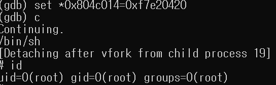

# GOT overwrite

다음의 c 코드로 만들어진 실행 파일을 통해 GOT overwrite 공격을 진행해 보도록 하겠다.

```c
#include <stdio.h>

int main(void) {
	char buf[32]; 
	
	gets(buf); 	
	puts(buf); 
	
	return 0; 
}
```

우리의 목표는 puts 대신 system 함수를 call 하도록 got를 overwrite를 하여 system("/bin/sh")의 효과를 내는 것이다. 

1. system 함수의 주소를 알아낸다. 
    
    아무데나 break point를 생성한 뒤 실행한 후, p system을 통해 system 함수의 주소를 알아낸다.
2. puts GOT를 알아낸다.

   PLT 주소를 disas 하여 GOT 주소를 알아낸다. 
3. GOT overwrite
 
    gdb 명령어 set *GOT 주소=system 주소 입력하여 GOT overwrite를 진행한다.
4. gets 실행될 때 /bin/sh를 입력한다. 

성공한다면 다음과 같이 shell을 획득할 수 있다.

